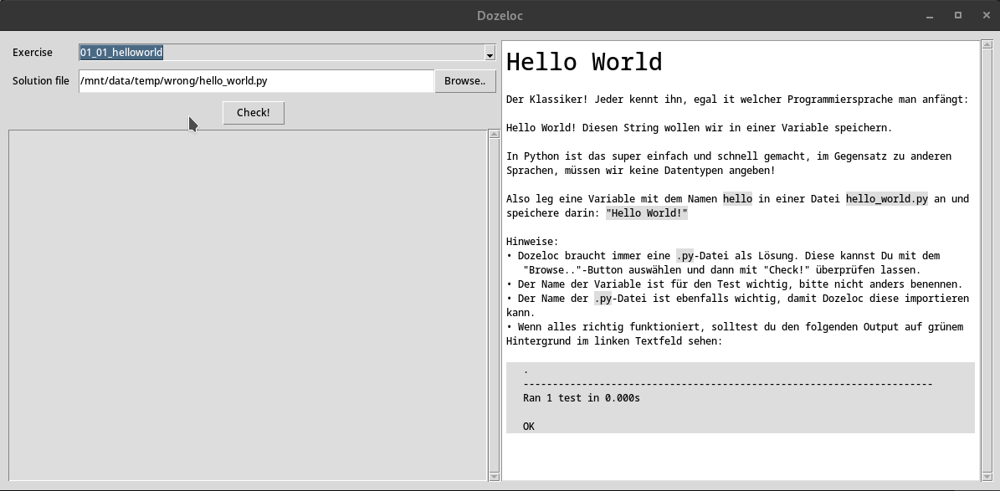

# Dozeloc

Dozeloc is a teaching tool for the local and automated checking of Python programming exercises.
It allows students to select exercises and run unit tests on their machine with little to no setup by just running a python script that opens a minimalistic and intuitive GUI.

## Quick start

```bash
python dozeloc.py path/to/exercise/folder
```

This will bring up the following GUI:



## Structure of exercise folders

The exercise folders must have the following structure where `code` formatting indicates fixed names and normal formatting indicates names that can change to your liking:

* nameOfFirstExercise
  * `test`
    * nameOfUnittest.py
    * nameOfOtherUnittest.py
  * exerciseDescription.md
* nameOfSecondExercise
  * `test`
    * nameOfUnittest.py
    * fileThatStudentsHaveToParse.csv
  * secondExerciseDescription.md
* ...

The unit test files should contain unit tests written with the module `unittest`.

## How to get a folder with exercises for testing Dozeloc

I'm working on that over at [exercise-heap](https://github.com/CSchoel/exercise-heap). :wink:

## Known issues

Dozeloc does not require any packages outside the Python standard library.
However, some distributions (including Ubuntu) do not install the full standard library but leave out the `tkinter` module.
In these cases you need to install the additional package `python-tk`.
